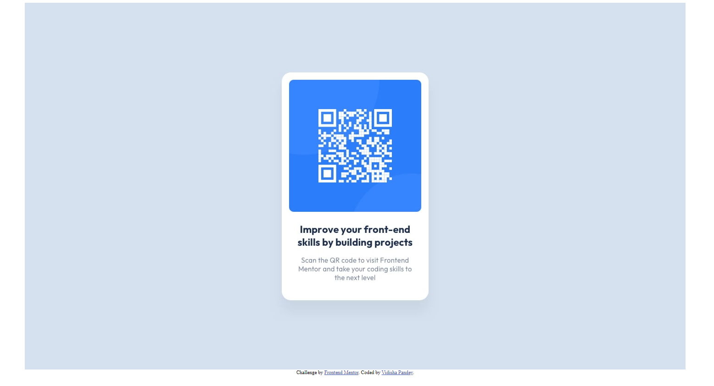

# Frontend Mentor - QR code component solution

This is a solution to the [QR code component challenge on Frontend Mentor](https://www.frontendmentor.io/challenges/qr-code-component-iux_sIO_H). Frontend Mentor challenges help you improve your coding skills by building realistic projects. 

## Table of contents

- [Overview](#overview)
  - [Screenshot](#screenshot)
  - [Links](#links)
- [My process](#my-process)
  - [Built with](#built-with)
  - [What I learned](#what-i-learned)
  - [Continued development](#continued-development)
- [Author](#author)

## Overview
This is a solution to the [QR code component challenge on Frontend Mentor](https://www.frontendmentor.io/challenges/qr-code-component-iux_sIO_H).
Technology used - HTML, CSS
Level - Newbie

### Screenshot



### Links

- Solution URL: [Add solution URL here](https://github.com/vp09/FrontendMentor-QR-Component)
- Live Site URL: [Add live site URL here](https://silly-truffle-9cbf73.netlify.app/)

## My process
1. created a div element with class="main" to store the images .
2. img tag for "desktop-design.jpg" and "mobile-design.jpg" giving classes <em>"desktop"</em> and <em>"mobile"</em> respectively to each image element.
3. making display property as <i>block</i> for "desktop" class while <i>none</i> for "mobile" class.
3. creating "style.scss" for storing the styles.
4. inserting @media query for screen smaller than 375px.
5.  changing display property as <i>none</i> for "desktop" class while <i>block</i> for "mobile" class.
6. making <em>main</em> class display property as <i>flex</i> to align the contents to center of the screen.

### Built with

- Semantic HTML5 markup
- CSS custom properties
- Flexbox
- SCSS
- Mobile-first workflow

### What I learned

```html
<div class="main">
    
      
      
    
    </div>
```
```scss
.main{  
    display:flex;
    justify-content: center;
    align-items: center;   
}
.desktop{
    display:block;   
   }
.mobile{
    display: none;
}


@media only screen and (max-width:375px) {
   .mobile{
    display: block;
   }
   .desktop{
    display: none;
            }
}

```

### Continued development

1. CSS grid and flexbox
2. media queries.

## Author
- Frontend Mentor - [@yourusername](https://www.frontendmentor.io/profile/vp09)


